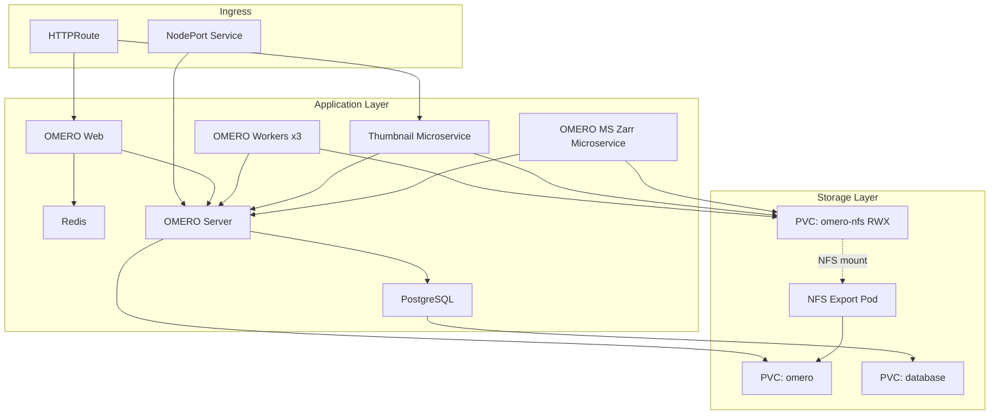

# OMERO on Kubernetes with Kustomize

Deploy [OMERO](https://www.openmicroscopy.org/omero/) on Kubernetes using Kustomize overlays.

The in-cluster NFS export requires a **privileged** pod, so these manifests require a cluster that permits privileged pods. Please refer to [Prerequisites](#prerequisites) for more details.

## Architecture




## Components

| Component | Description |
|-----------|-------------|
| **Database** | PostgreSQL 14 for OMERO data storage |
| **OMERO Server** | Core OMERO application server |
| **OMERO Web** | Django-based web interface |
| **OMERO Workers** | IceGrid worker nodes (Processor, Indexer, PixelData, DropBox) |
| **OMERO Thumbnail** | Thumbnail generation microservice |
| **OMERO MS Zarr** | Streams OMERO images as OME-Zarr on the fly |
| **Redis** | Session caching for OMERO Web |
| **NFS Export** | In-cluster NFS server providing ReadWriteMany access to OMERO data |

## Directory Structure

```
omero-kustomize/
├── base/                        # Shared manifests for all environments
│   ├── apps/                    # Application deployments
│   └── storage/                 # PVCs and NFS export
└── overlays/
    ├── dev/                     # Lightweight overlay, no ingress or domain required
    └── production/              # Production overlay (Gateway API, larger resources)
```

## Prerequisites

Both overlays:

- A Kubernetes cluster and `kubectl` configured to access it
- **Cluster-admin rights.** The NFS export defines a cluster-scoped `PersistentVolume` in
  [base/storage/nfs-export.yaml](base/storage/nfs-export.yaml).
- **A cluster that permits privileged pods.** The in-cluster NFS export server runs with
  `privileged: true` and mounts `nfsd`, so the `nfsd` kernel module must be available on the node.
- A StorageClass that supports `ReadWriteOnce` (for the `omero` and `database` PVCs)
- Nodes that can co-locate `omeroserver` and `nfs-export`. The `omero` PVC is `ReadWriteOnce` and is
  mounted by both, which works only because the NFS export declares a required pod affinity onto the
  OMERO server's node.

Production overlay only:

- Gateway API v1 CRDs, an implementation, and an existing `Gateway` to attach to. The overlay ships
  an `HTTPRoute`, not an `Ingress`.
- A domain and TLS certificates for it.

## Deployment

Both overlays deploy the same applications. They differ in how OMERO is reached from outside the
cluster, and in how they are sized.

| | Dev overlay | Production overlay |
|---|---|---|
| Gateway API | Not required | Required |
| Domain and TLS | Not required | Required |
| External access | `kubectl port-forward`, or add a NodePort/LoadBalancer Service | Gateway for OMERO.web, NodePort 30012 for OMERO.insight |
| Resources and storage | Small | Production-sized |


### Dev Overlay

Lightweight overlay for development and testing with small resource limits. Needs no Gateway API, no domain, and no TLS; access is via port-forward.

See **[overlays/dev/README.md](overlays/dev/README.md)** for full deployment instructions including:
- Quick start with `kubectl apply -k`
- Per-branch test instances with ArgoCD

### Production Overlay

Production-ready overlay with Gateway API ingress, NodePort for OMERO.insight, and larger resources.

See **[overlays/production/README.md](overlays/production/README.md)** for full deployment instructions including:
- Domain, storage, and gateway configuration
- Manual deployment with `kubectl apply -k`
- ArgoCD deployment using the provided template

## Customization Reference

| What to change | Where |
|----------------|-------|
| Domain name | `overlays/production/patches/omeroweb-prod.yaml`, `overlays/production/ingress/omeroweb-routes.yaml` |
| Storage sizes | `overlays/*/patches/pvc-*.yaml` |
| StorageClass | `overlays/*/patches/pvc-*.yaml` |
| Resource limits | `overlays/*/patches/<component>-*.yaml` |
| Image versions | `overlays/*/kustomization.yaml` (images section) |
| Worker replicas | `overlays/*/patches/omeroworker-*.yaml` |
| NodePort number | `overlays/production/ingress/omeroserver-nodeport.yaml`, or patch `omeroserver-ext` from your own overlay (see [production README](overlays/production/README.md#3-configure-the-gateway--nodeport)) |
| Gateway reference | `overlays/production/ingress/omeroweb-routes.yaml` |

## Secrets Reference

The `omero-secrets` Secret must contain these keys:

| Key | Used by |
|-----|---------|
| `POSTGRES_DB` | Database, OMERO Server, OMERO MS Zarr |
| `POSTGRES_USER` | Database, OMERO Server, OMERO MS Zarr |
| `POSTGRES_PASSWORD` | Database, OMERO Server, OMERO MS Zarr |
| `OMERO_ROOT_PASSWORD` | OMERO Server |
| `ICEGRID_USER` | OMERO Workers |
| `ICEGRID_PASS` | OMERO Workers |

## Contact

For any questions or to get in contact, please reach the team at omero@scilifelab.se or open an issue in this repository.
