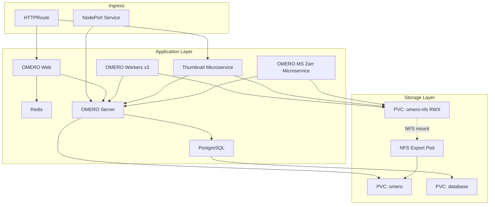

# OMERO on Kubernetes with Kustomize

Deploy [OMERO](https://www.openmicroscopy.org/omero/) on any Kubernetes cluster using Kustomize overlays.

## Architecture




## Components

| Component | Description |
|-----------|-------------|
| **Database** | PostgreSQL 14 for OMERO data storage |
| **OMERO Server** | Core OMERO application server |
| **OMERO Web** | Django-based web interface |
| **OMERO Workers** | IceGrid worker nodes (Processor, Indexer, PixelData, DropBox) |
| **OMERO Thumbnail** | Thumbnail generation microservice |
| **OMERO MS Zarr** | Streams OMERO images as OME-Zarr on the fly |
| **Redis** | Session caching for OMERO Web |
| **NFS Export** | In-cluster NFS server providing ReadWriteMany access to OMERO data |

## Directory Structure

```
omero-kustomize/
├── base/                        # Shared manifests for all environments
│   ├── apps/                    # Application deployments
│   └── storage/                 # PVCs and NFS export
└── overlays/
    ├── dev/                     # Lightweight dev/test overlay (localhost, small PVCs)
    └── production/              # Production overlay (ingress, larger resources)
```

## Prerequisites

- Kubernetes cluster 
- `kubectl` configured to access your cluster
- A StorageClass that supports `ReadWriteOnce` (for `omero` and `database` PVCs)
- (Production) A Gateway API implementation or Ingress controller # necessary for the production overlay
- (Production) TLS certificates for your domain # necessary for the production overlay

## Deployment

### Dev Overlay

Lightweight overlay for development and testing with small resource limits, no ingress, and localhost access via port-forward.

See **[overlays/dev/README.md](overlays/dev/README.md)** for full deployment instructions including:
- Quick start with `kubectl apply -k`
- Per-branch test instances with ArgoCD

### Production Overlay

Production-ready overlay with Gateway API ingress, NodePort for OMERO.insight, and larger resources.

See **[overlays/production/README.md](overlays/production/README.md)** for full deployment instructions including:
- Domain, storage, and gateway configuration
- Manual deployment with `kubectl apply -k`
- ArgoCD deployment using the provided template

## Customization Reference

| What to change | Where |
|----------------|-------|
| Domain name | `overlays/production/patches/omeroweb-prod.yaml`, `overlays/production/ingress/omeroweb-routes.yaml` |
| Storage sizes | `overlays/*/patches/pvc-*.yaml` |
| StorageClass | `overlays/*/patches/pvc-*.yaml` |
| Resource limits | `overlays/*/patches/<component>-*.yaml` |
| Image versions | `overlays/*/kustomization.yaml` (images section) |
| Worker replicas | `overlays/*/patches/omeroworker-*.yaml` |
| NodePort number | `overlays/production/ingress/omeroserver-nodeport.yaml` |
| Gateway reference | `overlays/production/ingress/omeroweb-routes.yaml` |

## Secrets Reference

The `omero-secrets` Secret must contain these keys:

| Key | Used by |
|-----|---------|
| `POSTGRES_DB` | Database, OMERO Server, OMERO MS Zarr |
| `POSTGRES_USER` | Database, OMERO Server, OMERO MS Zarr |
| `POSTGRES_PASSWORD` | Database, OMERO Server, OMERO MS Zarr |
| `OMERO_ROOT_PASSWORD` | OMERO Server |
| `ICEGRID_USER` | OMERO Workers |
| `ICEGRID_PASS` | OMERO Workers |

## Contact

For any questions or to get in contact, please reach the team at omero@scilifelab.se or open an issue in this repository. **
